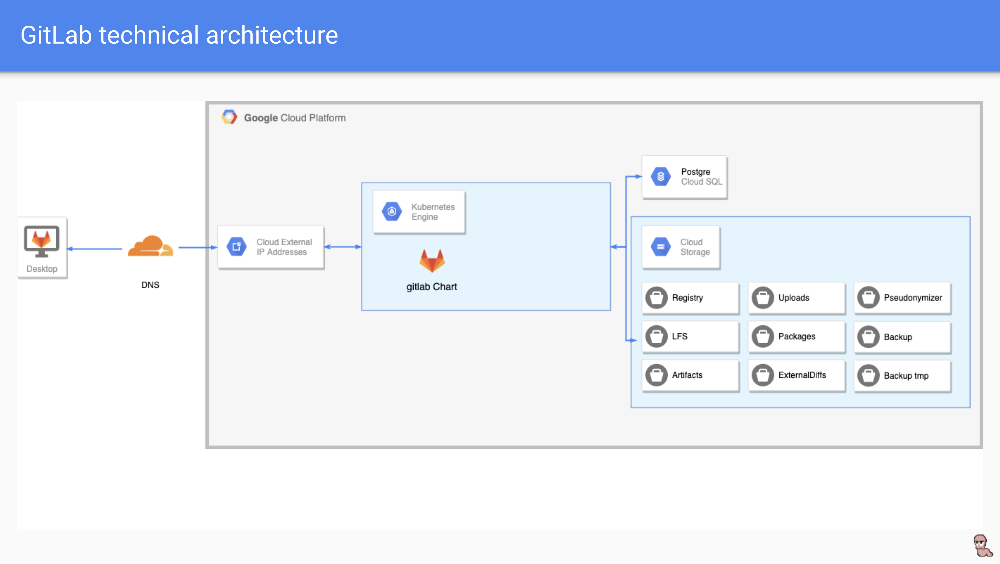

# meetup-devops-bbq
A support for [devops bbq meetup](https://www.meetup.com/fr-FR/Nantes-DevOps/events/262384537/)

This project aims to demonstrate a way to jointly deploy a cloud infrastructure with terraform and applications on kubernetes with helm.
In this example we use it to deploy a gitlab instance within a GCP infrastructure and a DNS management with Cloudflare.



In order to use this example for your own needs, you can follow the procedure below and adapt the code to your needs.

## Pre-requisites

##### Pipenv

This project use Pipenv for python dependencies. Follow the installation guide [here](https://github.com/pypa/pipenv).

- - - -

##### Terraform

This project use Terraform (v0.12 minimum) to build infrastructure. Follow the installation guide [here](https://www.terraform.io/).
In this project we use : 

- [Google Cloud Platform Provider](https://www.terraform.io/docs/providers/google/index.html)
- [Cloudflare Provider](https://www.terraform.io/docs/providers/cloudflare/index.html)
- [Random Provider](https://www.terraform.io/docs/providers/random/index.html)


- - - -

##### GCP
A GCP account with billing enabled is required.
To suit your needs, you will need to change the main.tf file in order to provide folder_id and billing_account arguments to the gcp project.

- - - -

##### Google Cloud SDK

This project use Google Cloud SDK to authenticate and interract with GKE. Follow the installation guide [here](https://cloud.google.com/sdk/).

You'll need to set gcloud application default credentials

```language-bash
gcloud auth application-default login
```

and install gcloud kubernetes component

```language-bash
gcloud components install kubectl
```

- - - -

##### Helm

This project use for resources templating / package management for kubernetes. Follow the installation guide [here](https://helm.sh/).

- - - -

## Configuration

##### The Manifest
The manifest is a yaml file in which we will describe all no sensitive variables passed to the deployment script.
Sensitive variables will be passed into environment variables so that they are not versioned.

You must create a manifest that meets the needs of your deployment in the manifest folder. 
An example shows you the structure that your manifest must meet.

##### Interoperability
For this project, interoperability storage is required.
To setup storage interoperability see documentation [here](https://cloud.google.com/storage/docs/migrating#keys).

And set Interoperability credentials as env variables :

```language-bash
export S3CMD_ACCESS_KEY=<YOUR_INTEROPERABILITY_ACCESS_KEY>
export S3CMD_SECRET_KEY=<YOUR_INTEROPERABILITY_SECRET_KEY>
```

##### Cloudflare
In that example, we use cloudflare as DNS provider.
Cloudflare credentials must be set as env variables :

```language-bash
export CLOUDFLARE_EMAIL=<YOUR_CLOUDFLARE_EMAIL>
export CLOUDFLARE_TOKEN=<YOUR_CLOUDFLARE_TOKEN>
```

##### Initialize project
To prepare the project, run

```language-bash
./init.sh
```

##### Build
To build the project.

```language-bash
pipenv run python apply.py
```

##### Destroy
To destroy the project.

```language-bash
pipenv run python destroy.py
```
